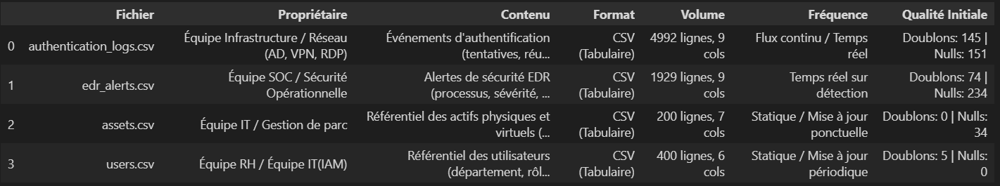

# Security Log Project
Audit et Qualification des Données

## Contexte du Projet
Ce projet s'inscrit dans le module de Gestion et Suivi de Projet. L'objectif est de réaliser un audit de qualité, un nettoyage et une normalisation des données historiques transmises par les équipes IT afin de déterminer leur exploitabilité pour la conception d'un système de classification et de priorisation des événements de sécurité.

## 1. Structure du Dépôt

```text
security-log-project/
├── data/
│   ├── raw/          # Fichiers sources d'origine (immuables)
│   └── processed/    # Données nettoyées, normalisées et journaux d'audit
├── docs/             # Documentation des règles de gestion et dictionnaires
├── notebooks/        # Notebooks d'exploration (EDA) et de nettoyage
├── src/              # Scripts de transformation Python
├── tests/            # Tests unitaires sur les règles de qualité
└── README.md         # Documentation principale du projet
````

## 2. Inventaire et Description des Sources

Les données fournies sont entièrement synthétiques, livrées sans contrôle qualité préalable et accompagnées de documentations partielles issues d'outils hétérogènes.

